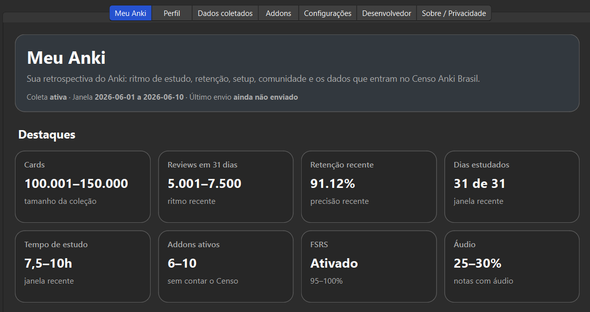
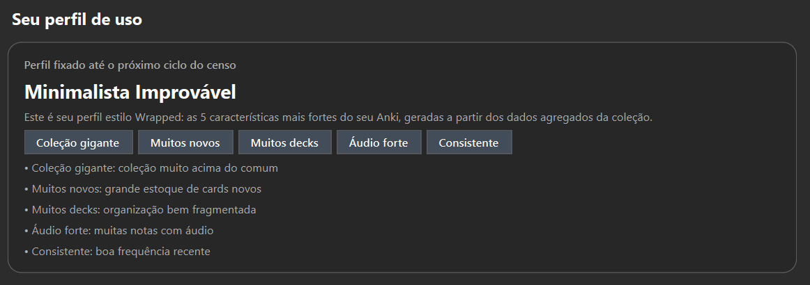

# Censo Anki Brasil

Addon para Anki Desktop que gera um painel local de estatísticas do usuário e, nas janelas semestrais do censo, envia dados agregados para uma API pública de resultados.

A ideia do projeto é ter duas camadas:

1. **Meu Anki**: um painel no próprio Anki Desktop com métricas da coleção, atividade recente, FSRS, mídia, addons e comparações com a comunidade quando houver dados públicos suficientes.
2. **Censo Anki Brasil**: uma coleta semestral de dados agregados para acompanhar como usuários brasileiros utilizam o Anki e quais padrões aparecem ao longo do tempo.

Autor: **Danyel Barboza — Comunidade Anki Brasil**

---

## Visão geral

A tela principal, **Meu Anki**, mostra um resumo técnico do uso local do Anki:

- quantidade aproximada de cards, notas, decks, tags e tipos de nota;
- atividade recente de revisão;
- retenção nos últimos períodos;
- dias estudados;
- uso de FSRS;
- distribuição de botões (`Again`, `Hard`, `Good`, `Easy`);
- volume e composição de mídia;
- addons instalados;
- perfil de uso gerado a partir dos dados agregados;
- comparações com a comunidade quando os resultados públicos estiverem disponíveis.




Depois da coleta, o painel também pode exibir percentis e comparações do usuário com a base agregada do censo, como:

- posição em reviews recentes;
- posição em tempo de estudo;
- posição em tamanho da coleção;
- comparação de retenção;
- comparação por estado, região e área de estudo;
- uso de addons em relação aos addons mais comuns da comunidade.

---

## Estrutura do projeto

```text
addon/      Addon modular do Anki Desktop
worker/     API Cloudflare Worker + banco Cloudflare D1
scripts/    Script de empacotamento do addon
privacy.md  Política de privacidade do projeto
```

O repositório também contém o arquivo:

```text
dicionario-dados-censo-anki-brasil.ods
```

Esse dicionário de dados documenta os campos enviados pelo addon, seus tipos, exemplos, origem de coleta e observações de privacidade.

---

## Requisito de versão

- Anki Desktop **24.06+**
- Windows, macOS ou Linux

O addon roda no **Anki Desktop**. Ele não roda diretamente no AnkiWeb, AnkiDroid ou AnkiMobile.

Dados de revisão feitos em outros dispositivos podem aparecer no painel se estiverem sincronizados com a coleção local do Anki Desktop.

---

## Janelas de coleta

O censo é semestral.

```text
01/06 a 10/06
10/12 a 20/12
```

Exemplos de `survey_id`:

```text
censo-anki-brasil-2026-1
censo-anki-brasil-2026-2
```

Durante a janela de coleta, o addon envia automaticamente uma resposta por instalação/usuário local, desde que a participação não esteja pausada nas configurações.

Se o envio falhar, o addon tenta novamente em uma próxima abertura do Anki Desktop dentro da janela de coleta.

---

## Tela principal: Meu Anki

A aba **Meu Anki** é o painel principal do addon.

Ela mostra dados locais do usuário e, quando a API pública já tiver resultados suficientes, adiciona comparações com a comunidade.

Exemplos de leituras possíveis:

```text
Você está no top X% em reviews recentes.
Sua retenção ficou acima de X% da comunidade.
Usuários da sua área tiveram retenção média de X%.
Na sua região, o uso médio de FSRS foi X%.
Você usa X dos 10 addons mais populares da comunidade.
```

A aba também inclui gráficos locais, como:

- composição de mídia;
- distribuição dos botões de resposta;
- evolução do semestre;
- comparações com médias públicas quando disponíveis.

---

## Dados enviados

O addon envia estatísticas agregadas e metadados técnicos. O objetivo é permitir análise da comunidade sem acessar conteúdo pessoal.

Exemplos de dados coletados:

- versão do Anki;
- sistema operacional;
- addons instalados;
- quantidade aproximada de cards, notas, decks e tags;
- uso de FSRS;
- retenção;
- revisões recentes;
- dias estudados;
- tempo aproximado de estudo;
- proporção de mídia;
- perfil opcional preenchido pelo usuário;
- fingerprint agregado para apoiar deduplicação.

A maioria dos campos numéricos é enviada em faixas. Alguns percentuais, como retenção, podem ser enviados de forma mais granular quando isso for útil para análise.

O dicionário completo dos campos está em:

```text
dicionario-dados-censo-anki-brasil.ods
```

---

## Dados que não são enviados

O addon **não envia**:

- conteúdo de cards;
- conteúdo de notas;
- nomes de decks;
- nomes de tags;
- nomes de campos;
- nomes de tipos de nota;
- arquivos de mídia;
- nomes de arquivos de mídia;
- e-mail;
- nome real;
- login do AnkiWeb;
- caminho local da coleção no computador.

A política de privacidade está em:

```text
privacy.md
```

---

## Identificação local e deduplicação

Cada instalação gera um `user_id` anônimo salvo localmente.

Além disso, o payload inclui um `usage_fingerprint`, calculado a partir de campos agregados e estáveis. Ele ajuda a estimar possíveis duplicidades, por exemplo quando uma pessoa usa Anki Desktop em mais de um computador.

O fingerprint não substitui o `user_id`. Ele serve apenas para análise agregada.

---

## Backend

O backend usa:

- Cloudflare Worker;
- Cloudflare D1;
- endpoints HTTP;
- validação básica de payload;
- tabelas separadas para envio real e envio de debug.

---

## Endpoints públicos

```text
GET  /config        Configuração pública do censo atual
POST /submit        Envio real do addon
POST /debug-submit  Envio de teste da área de desenvolvedor
GET  /results       Resultados públicos agregados em JSON
GET  /results.html  Página HTML simples com resultados públicos
```

O endpoint `/results` é o principal ponto de acesso para análises externas, dashboards ou relatórios do censo.

---

## Deploy do backend

Entre na pasta do Worker:

```bash
cd worker
npm install
npx wrangler login
```

Crie o banco D1:

```bash
npm run db:create
```

A Cloudflare vai retornar um bloco parecido com:

```toml
[[d1_databases]]
binding = "DB"
database_name = "censo-anki-brasil-db"
database_id = "xxxxxxxx-xxxx-xxxx-xxxx-xxxxxxxxxxxx"
```

Copie o `database_id` e substitua o valor correspondente em:

```text
worker/wrangler.toml
```

Crie as tabelas:

```bash
npm run db:init
```

Publique o Worker:

```bash
npm run deploy
```

O Wrangler vai retornar uma URL pública no domínio `workers.dev`.

---

## Configuração da URL da API

O addon vem com uma URL padrão definida no projeto.

Se for necessário usar outra API, há duas opções.

### Pela interface do addon

No Anki Desktop:

```text
Ferramentas → Censo Anki Brasil → Configurações → URL da API
```

### No build do pacote

Na raiz do projeto:

```bash
python scripts/build_addon.py --api-url "https://censo-anki-brasil-api.SEUSUBDOMINIO.workers.dev"
```

O arquivo `.ankiaddon` será criado em:

```text
dist/
```

---

## Empacotamento para AnkiWeb

Na raiz do projeto:

```bash
python scripts/build_addon.py --api-url "https://censo-anki-brasil-api.SEUSUBDOMINIO.workers.dev"
```

Depois, envie o arquivo `.ankiaddon` gerado em `dist/` para o AnkiWeb Add-ons.

---

## Área de desenvolvedor

A área de desenvolvedor fica dentro do painel do addon.

Senha padrão:

```text
4599
```

Funções disponíveis:

- visualizar o JSON final;
- copiar o JSON;
- salvar o JSON;
- enviar payload de teste para `/debug-submit`;
- resetar o status local de envio.

O envio de debug é salvo em tabela separada e não entra nos resultados públicos do censo.

---

## Licença e transparência

O projeto é aberto para auditoria. A proposta é manter público:

- código do addon;
- código da API;
- dicionário de dados;
- política de privacidade;
- endpoints públicos de resultado;
- lógica geral de coleta e agregação.
